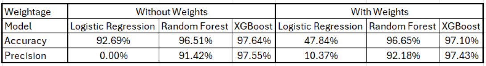

# Small Businesses Loan Default Prediction
> Predicting defaults in SBA 7(a) and 504 loan programs using feature engineering and machine learning.  

         

---

## Table of Contents
- [Project Description](#project-description)
- [Importance of Problem](#importance-of-problem)
- [Exploratory Analysis](#exploratory-analysis)
- [Feature Engineering](#feature-engineering)
- [Solution](#solution)
  - [Modeling Setup](#modeling-setup)
  - [Models Considered](#models-considered)
  - [Addressing Class Imbalance](#addressing-class-imbalance)
- [Summary](#summary)
- [Practical Implementations](#practical-implementations)
- [Appendix](#appendix)

---

## Project Description
This project addresses the challenge of predicting loan defaults within the U.S. Small Business Administration’s (SBA) **7(a)** and **504** loan programs. The 7(a) program focuses on financing the purchase of a business or working capital (max **$5M**), while the 504 program focuses on commercial real estate or heavy machinery (max **$30M**). Together, these programs expand access to capital when conventional bank loans may not.  

**Data sources & scope**
- **7(a)**: 2020–present  
- **504**: 2010–present (filtered to 2020–present for consistency)  
- Data include financial attributes (loan amounts, interest rates), business characteristics (type, age), and loan terms (length, collateral).  
- Target is **loan default** (charged-off). Only loans with definitive outcomes—**Paid in Full** or **Charged Off**—are used. A binary label `LoanSuccess` is created (PIF=0, ChargedOff=1).  

---

## Importance of Problem
Defaults drive direct losses for lenders and the SBA, constraining future guarantees and the broader flow of credit to small businesses—key drivers of job creation. Early and accurate default prediction enables proactive steps (term modification, monitoring, counseling) and helps allocate capital to borrowers with higher likelihood of success, supporting program sustainability.  

---

## Exploratory Analysis
**Data preparation**
1. Merge 7(a) and 504 datasets; standardize column names.  
2. Restrict to **2020+** for relevance and alignment.  
3. Filter to definitive outcomes and derive `LoanSuccess`.  
4. Handle missingness: drop features with **>70%** missing values; impute remaining missing numeric values with **0** and categorical with **“Missing”**; exclude text-heavy and target-leaky fields.

> **Dataset metrics**  
> *Initial dataset size:*  504(111585, 40) | 7a(330705, 43)  
> *Size of the dataset after merge:* (371612, 53)  
> *Shape of the dataset after filtering `LoanStatus`:* (52181, 54)  
> *Dataset size after missing value imputation:* (52178, 40)  
> *Final shape of the dataset before EDA and Feature Engineering:* **(52178, 22)**  

**Key EDA insights**
- **Severe class imbalance**: ~**94%** paid in full vs. **6%** defaulted.  
- **Program differences**: 504 approvals typically larger than 7(a).  
- **Temporal trend**: Spike in average approvals in **2021** (pandemic period), followed by declines (post-pandemic normalization + rising rates).  
- **Volume & defaults**: Total loan counts decline from **2020 → 2024**; default counts roughly stable, implying an **increasing default share** over time.  

> **Note on figures**  
> [*Figure 1*](#figure-1)*:* Distribution of Loan Success (0=Paid in Full, 1=Charged Off)  
> [*Figure 2*](#figure-2)*:* Distribution of Gross Approval Amounts by Loan Program  
> [*Figure 3*](#figure-3)*:* Relationship between GrossApproval and Approval Fiscal Year  
> [*Figure 4*](#figure-4)*:* Count of Loan Success and Failure by Fiscal Year  

---

## Feature Engineering
Three ratios were engineered to capture relationships not obvious in raw values:  

- **SBA Guarantee Ratio** = `SBAGuaranteed / GrossApproval`  
  - Wider IQR for defaulted loans suggests predictive value ([*Figure 5*](#figure-5)).

- **Loan Term Burden Ratio** = `GrossApproval / TermMonths`  
  - Median separation indicates higher ratios associate with better outcomes ([*Figure 6*](#figure-6)).

- **Jobs Impact Efficiency Ratio** = `GrossApproval / JobsSupported`  
  - Higher medians among successful loans point to usefulness as a predictor ([*Figure 7*](#figure-7)).

> **Note**: Ratios help normalize for scale and uncover efficiency/effectiveness signals that single features may obscure.  

---

## Solution

### Modeling Setup
- One-hot encode categorical features to provide binary indicators for classifiers.  
- Train–test split: **80/20**.  
- Evaluation on holdout test set.  

> *Shape of the dataset after One-Hot Encoding:* **(52178, 163)**  

### Models Considered
| Model | Rationale | Strengths | Considerations |
|---|---|---|---|
| **Logistic Regression** | Baseline for binary classification | Interpretable coefficients, fast | May underfit complex, non-linear relations |
| **Random Forest** | Ensemble of decision trees | Handles interactions, robust to noise | Less interpretable, tuning can be data-hungry |
| **XGBoost** | Gradient-boosted trees | Strong performance on tabular data | Sensitive to class imbalance; requires careful tuning |

### Addressing Class Imbalance
Initial predictions were skewed due to the **94/6** class split. Class weights were applied to all models to put more emphasis on the minority class. Post-weighting, **False Negatives** and **False Positives** rose in a balanced way, improving **True Positives (defaults correctly identified)**. Overall **accuracy dipped** slightly but remained **> 90%**, an acceptable trade-off for better minority-class detection.  

> **Note on figures**  
> [*Figure 8*](#figure-8)*:* Confusion Matrix (without weights)  
> [*Figure 9*](#figure-9)*:* Confusion Matrix (with weights)  
> [*Figure 10*](#figure-10)*:* Accuracy and Precision Comparison across models (with and without weights)  

> **Why prioritize recall on defaults?**  
> Missing a default (false negative) can be more costly than flagging a healthy loan (false positive), given the downstream risk and loss severities.

---

## Summary
The workflow cleans and unifies 7(a)/504 loans (2020+), engineers targeted ratios, and evaluates **Logistic Regression**, **Random Forest**, and **XGBoost** models under class weighting to counter severe imbalance. The result is a more balanced and reliable framework for **default detection**, even with a dominant majority class.  

---

## Practical Implementations
- **Enhanced Risk Assessment**: Model-informed risk scores complement manual review, reducing bias and improving portfolio quality.  
- **Targeted Lending**: Identify segments with higher success likelihood for tailored products and outreach.  
- **Policy Refinement**: Use feature insights to adjust criteria for fairer, more effective lending.  
- **Early Warning System**: Monitor active loans to flag emerging distress for proactive counseling and restructures.  

---

## Appendix
**Data Source**  
- [SBA FOIA datasets for 7(a) and 504 programs](https://data.sba.gov/en/dataset/7-a-504-foia)  

**Referenced Figures**  
- ### *Figure 1*  
    
- ### *Figure 2*  
    
- ### *Figure 3*  
    
- ### *Figure 4*  
    
- ### *Figure 5*  
    
- ### *Figure 6*  
    
- ### *Figure 7*  
    
- ### *Figure 8*  
    
- ### *Figure 9*  
    
- ### *Figure 10*  
    
